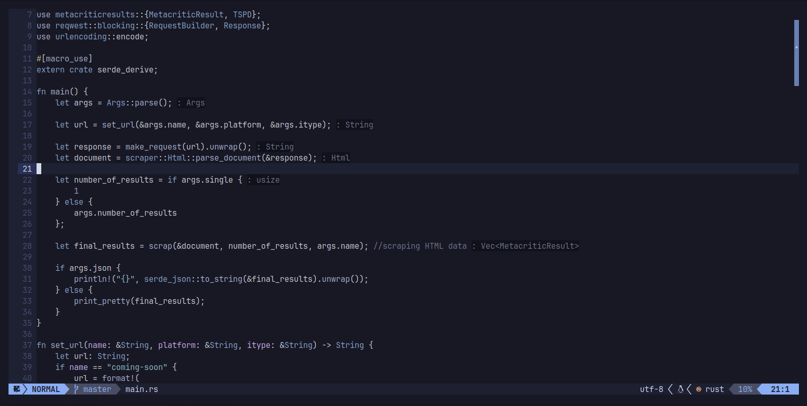

## Table of Contents
1. [About](#about)
2. [Requirements](#requirements)
3. [TL;DR](#tldr)
4. [Keybindings](#keybindings)
5. [Completion](#completion)
6. [Other features](#other-features)

## About 
I recently switched from vim (using vimscript) to neovim (using lua), so I decided to publish my new config. This is not final version of course. My goal is to improve my configuration and keep it the same accross two systems: macos and arch. 
This is two days version of having fun with configuration. 

There is a lualine with some theme, and iceberg-based colorscheme (https://github.com/cocopon/iceberg.vim) with my background but you probably change it so whatever.

It looks like this:

## Requirements
- nvim >= 0.9.1
- ripgrep (https://github.com/BurntSushi/ripgrep)
- ranger (https://github.com/ranger/ranger)
- gitui (https://github.com/extrawurst/gitui)

## TL;DR
Run this commands to install my configs:
```bash
#Maybe backup your current config first ;)
$ git clone https://github.com/Nithe14/.nvim.git ~/.config/nvim
$ sed -i "s/nithe/$USER/g" ~/.config/nvim/lua/variables.lua
```
The config is ready! This is time to install all plugins. Run this commands in nvim:
```vim
:PackerInstall
:PackerSync
```
Everything should be set up :)

## Keybindings
The most important keybind is as always leader. For me it is a `,` char. It's pretty handy, don't you think?

#### Basic
| Mapping  |      Action   |
|----------|:-------------:|
| `<leader>w` |  Save current buffer |
| `<leader>q` |  Close the buffer. If there is more buffers open only the current will be closed. |
| `<leader>1q` | Force to close. Close all buffers, do not save them and do not warning about it.|
| `<leader>tt` | Trigger floating terminal |
|`<leader>gg`| Trigger floating gitui |
|`<leader>c<Space>` | Comment/uncomment selected lines. In normal mode comment/uncomment current line. |
|`<leader>l` | Toggle twilight (focus mode) |
|`<leader>s` | Toggle shade (dim unselected tabs)|
|`<M-Up/Down>` | Shade brightness up/down |
|`<leader><cr>` | Clear all selected matching |
| `<C-h/j/k/l>` | Switch focus to left/down/up/right window |
|`<C-up/down>` | Trigger multi cursor. |


**There is an error with the shade plugin. Coc HintFloat windows doesn't appear if shade is enabled. I'm working on it, but for now, if there is a hint sign (">>") in the left column, I disable the shade plugin with the `<leader>s` binding.**
#### Telescope 

| Mapping  |      Action   |
|----------|:-------------:|
| `<leader>ff` | Trigger floating fuzzy file finder. |
|`<leader>fg` | Trigger floating live grep. | 
|`<leader>fb` | Trigger floating buffers selector. |
|`<leader>fl` | Trigger floating fuzzy line finder. |
|`<leader>fm` | Trigger floating old files (mru) finder. |
|`<leader>ft` | Trigger floating file type selector. |
|`<leader>ftt` | Trigger floating treesitter (funcs, variable, structs finder). |
|`<leader>fcs` | Trigger floating colorscheme selector. |
|`<leader>fgc` | Trigger floating git commits selector. |
|`<leader>fgb` | Trigger floating git branches selector. |
| `<leader>y` | Trigger floating undo history |

#### Plugin manager
| Mapping  |    Action     |
|----------|:-------------:|
|`<leader>PI`| Install all plugins with Packer|
| `<leader>PS`| Sync/Upgrade all plugins with Packer|

#### File manager
| Mapping  |      Action   |
|----------|:-------------:|
|`<leader>rr` | Open ranger in the current path. |


## Completion 
This config uses coc (https://github.com/neoclide/coc.nvim). So the code completion is very powerful and simple to use. Just find your favorite language coc server and install it from vim command. Exmaple:
```vim
:CocInstall coc-rust-analyzer
```
## Other features 
NeoVim can keep all changes you made in a single dir. I set it to ~/.config/nvim/undo. So you can undo and redo changes in any file even if you close it.

_That's it for now..._
